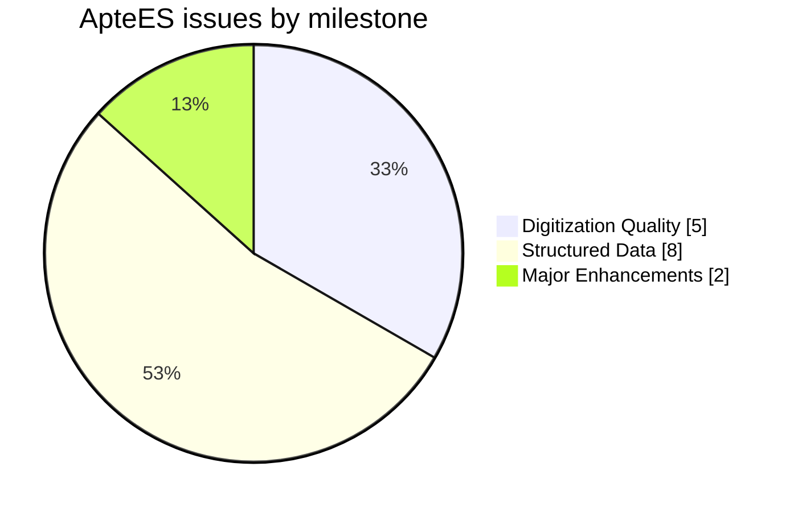
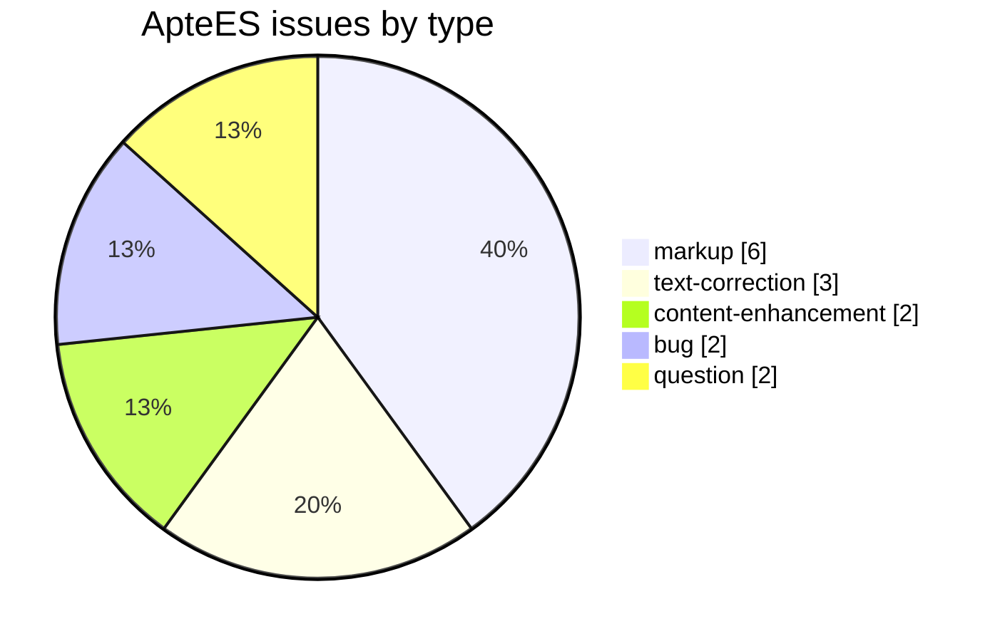
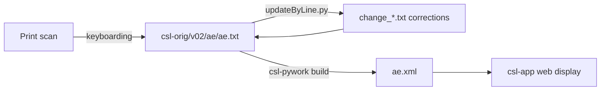

# ApteES — Apte *The Student's English-Sanskrit Dictionary* (1884)

_Created: 15-07-2014 · Last updated: 05-07-2026_

Development and correction repository for **Vaman Shivram Apte's *The Student's English-Sanskrit Dictionary***, an English→Sanskrit dictionary, part of the [Cologne Digital Sanskrit Lexicon](https://www.sanskrit-lexicon.uni-koeln.de/) (CDSL). The canonical source text lives in [`csl-orig/v02/ae/ae.txt`](https://github.com/sanskrit-lexicon/csl-orig/blob/master/v02/ae/ae.txt) (English headwords); this repository holds the development, correction, and enrichment work.

A **reverse-direction** dictionary: English headwords (in `{@…@}`) with Sanskrit equivalents (SLP1, in `<s>…</s>`) and circled sense markers (Ⓐ, Ⓑ …). One of several English→Sanskrit works in CDSL (alongside the Monier-Williams *MWE* 1851 and Borooah *BOR* 1877). Its markup differs from the Sanskrit→X dictionaries — see **Data format** in [CLAUDE.md](CLAUDE.md).

## Documentation

- [CLAUDE.md](CLAUDE.md) — repository guide and data-format reference.
- [DATA_DICTIONARY.md](DATA_DICTIONARY.md) — markup tag reference.
- [CONTRIBUTING.md](CONTRIBUTING.md) · [CODE_OF_CONDUCT.md](CODE_OF_CONDUCT.md)

## Contents

| Path | Purpose |
|---|---|
| `ae_saninvert/` | `ae_saninvert/` working files |
| `hwspellcheck/` | `hwspellcheck/` working files |
| `issues/` | Per-issue working files |
| `transcode/` | `transcode/` working files |

## Usage example

A real entry from [`csl-orig/v02/ae/ae.txt`](https://github.com/sanskrit-lexicon/csl-orig/blob/master/v02/ae/ae.txt) — line 65, the "abduct" entry:

```
65:{@Abduct@}¦,Ⓒ<lex>v. t.</lex>Ⓓ<s>apahf</s> 1 <ab>P</ab>.
```

To correct a typo in this line (e.g. `apahf` → `apahR`, a transcoding fix), write a change file in the standard paired-line format and apply it with `updateByLine.py`:

```
; issueNNN: fix SLP1 typo in "abduct" (apahf -> apahR)
65 old {@Abduct@}¦,Ⓒ<lex>v. t.</lex>Ⓓ<s>apahf</s> 1 <ab>P</ab>.
65 new {@Abduct@}¦,Ⓒ<lex>v. t.</lex>Ⓓ<s>apahR</s> 1 <ab>P</ab>.
```

```sh
python updateByLine.py ae.txt change_65.txt ae_corrected.txt
```

(Illustrative — no actual defect at this line; the correction workflow above is exact, only the fictitious typo is invented to demonstrate the change-file mechanics.)

## Timeline

| Period | Activity |
|---|---|
| 2014 | Repository activity begins (first tracked issues) |
| 2016–2024 | Ongoing corrections, markup, and comparison work |
| 2026-05 | Issue taxonomy, citation metadata, documentation |

## Projects & Milestones

| Milestone | Open | Closed | Total |
|---|---|---|---|
| Dictionary to Book | 0 | 0 | 0 |
| Digitization Quality | 0 | 5 | 5 |
| Structured Data | 2 | 6 | 8 |
| Major Enhancements | 0 | 2 | 2 |
| **Total** | **2** | **13** | **15** |



## Issues



### Open

| # | Title | Type | Severity | Milestone |
|---|---|---|---|---|
| 1 | Normalizing pada-gana 'spelling' in digitization | markup | minor | Structured Data |
| 9 | markup needed for display usefulness | markup | minor | Structured Data |

### Solved

| # | Title | Type | Severity | Milestone |
|---|---|---|---|---|
| 2 | New wikisource locations | content-enhancement | medium | Major Enhancements |
| 3 | Title overlapping | bug | minor | Digitization Quality |
| 4 | Corrections of 'missing data' | question | minor | Structured Data |
| 5 | Headword corrections | text-correction | minor | Digitization Quality |
| 6 | Ngram approach to finding errors in Sanskrit words of AE | text-correction | minor | Digitization Quality |
| 7 | Can anusvAra precede vowel | question | minor | Structured Data |
| 8 | धर्मः -घासरः | text-correction | minor | Digitization Quality |
| 10 | Flaw in Python re.split | bug | minor | Digitization Quality |
| 11 | Display improvement, continue | content-enhancement | medium | Major Enhancements |
| 12 | Change of notation | markup | minor | Structured Data |
| 13 | Transfer printchanges to new ae | markup | minor | Structured Data |
| 14 | Revise ae-meta2 | markup | minor | Structured Data |
| 15 | [markup] Minor ae.txt Markup Oddities | markup | minor | Structured Data |

## Labels

### Type labels

| Label | Meaning |
|---|---|
| `link-target` | Click-throughs from `<ls>` abbreviations to scanned PDF pages |
| `link-splitting` | Splitting combined `SOURCE N,N` refs into per-page links |
| `markup` | Normalising XML tag content |
| `text-correction` | Corrections to Sanskrit/Sanskrit definitions or headwords |
| `content-enhancement` | New material or structural additions beyond correction |
| `encoding` | SLP1/IAST transcoding, character normalisation |
| `scan-quality` | Replacing blurry/skewed/missing scan pages |
| `bug` | Broken links, XML errors, broken downloads |
| `question` | Scholarly questions requiring research |

### Severity labels

| Label | Meaning |
|---|---|
| `minor` | Targeted fix — a handful of lines or a single file |
| `medium` | Standard unit of work — one batch of corrections |
| `hard` | Large effort spanning many sources or files |

## Contributors

| Contributor | Commits |
|---|---|
| funderburkjim | 21 |
| gasyoun (Mārcis Gasūns) | 19 |

## Source

- **Author**: Apte, Vaman Shivram
- **Title**: *The Student's English-Sanskrit Dictionary*
- **Place / Publisher**: Poona
- **Year(s)**: 1884 (1st ed.); CDSL digitisation from the 1920 edition
- **Language pair**: English → Sanskrit
- **License (digital edition)**: CC BY-SA 4.0
- See [CITATION.cff](CITATION.cff) for machine-readable citation.

## Encoding

- UTF-8 (NFC) throughout.
- English headwords in `{@…@}`; Sanskrit equivalents in SLP1 within `<s>…</s>`; circled sense markers (Ⓐ, Ⓑ …).
- Devanāgarī and IAST display forms are generated at display time, not stored in the source.

## How it works



---
*Issue taxonomy and documentation per the [Cologne issue runbook](https://github.com/sanskrit-lexicon/csl-observatory/blob/main/runbook/cologne-issue-runbook.md).*

_Dr. Mārcis Gasūns_
