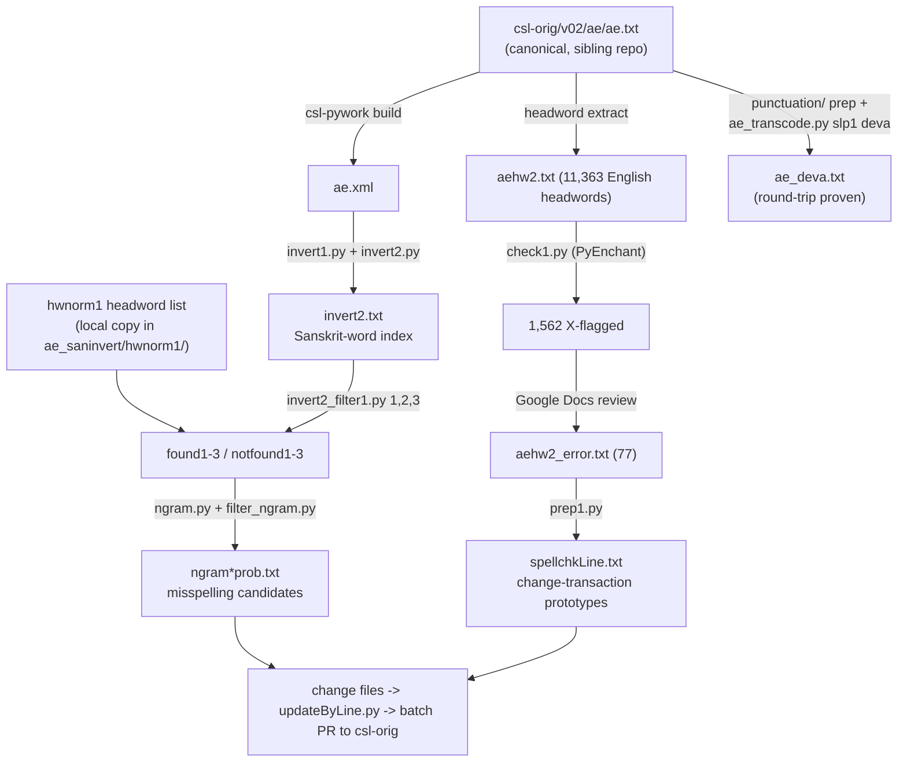

# ApteES tooling — operator manual

_Created: 11-07-2026 · Last updated: 11-07-2026_

This is the **operator manual** for the ApteES repository's three tool
pipelines — Sanskrit-side inversion ([ae_saninvert/](https://github.com/sanskrit-lexicon/ApteES/tree/main/ae_saninvert)),
headword spellcheck ([hwspellcheck/](https://github.com/sanskrit-lexicon/ApteES/tree/main/hwspellcheck)),
and SLP1↔Devanāgarī transcoding ([transcode/](https://github.com/sanskrit-lexicon/ApteES/tree/main/transcode)) —
plus the per-issue correction folders, for Apte's *The Student's
English-Sanskrit Dictionary* (1884). The test is operational: a newcomer runs
each tool from this manual alone.

Three documents describe this repo, with different jobs:

- **What the repo is** (timeline, issue typology, a worked change-file
  example) — [README.md](https://github.com/sanskrit-lexicon/ApteES/blob/main/README.md);
- **Code contract for AI/code sessions** (entry format with annotated
  example) — [CLAUDE.md](https://github.com/sanskrit-lexicon/ApteES/blob/main/CLAUDE.md);
- **How to operate the tools** (this document) —
  [docs/TOOLING_MANUAL.md](https://github.com/sanskrit-lexicon/ApteES/blob/main/docs/TOOLING_MANUAL.md).

Commands are quoted verbatim from the three tool readmes
([ae_saninvert/readme.txt](https://github.com/sanskrit-lexicon/ApteES/blob/main/ae_saninvert/readme.txt),
[hwspellcheck/readme.org](https://github.com/sanskrit-lexicon/ApteES/blob/main/hwspellcheck/readme.org),
[transcode/readme.txt](https://github.com/sanskrit-lexicon/ApteES/blob/main/transcode/readme.txt));
scripts and data files verified on disk 11-07-2026. The inversion and
spellcheck pipelines are 2014–2016-era one-time studies whose *outputs* are
the durable value; the transcode pipeline is deterministic and re-runnable.

## The dictionary's special shape (read this first)

AE is a **reverse-direction** dictionary: English headwords (`<k1>`, and
`{@…@}` in the body), Sanskrit *equivalents* in SLP1 inside `<s>…</s>`,
circled sense markers `Ⓐ Ⓑ …`, and `¦` as headword/definition separator —
see the annotated first entry in
[CLAUDE.md § Data format](https://github.com/sanskrit-lexicon/ApteES/blob/main/CLAUDE.md#data-format).
Two consequences drive all three tools:

1. The Sanskrit words are **not headwords**, so they are invisible to the
   usual headword QA — hence `ae_saninvert` (build a Sanskrit-side index and
   validate it against the cross-dictionary headword list) and `transcode`
   (render them in Devanāgarī).
2. The headwords are **English**, so ordinary English spell-checking works on
   them — hence `hwspellcheck`.

The canonical text is
[csl-orig `v02/ae/ae.txt`](https://github.com/sanskrit-lexicon/csl-orig/blob/master/v02/ae/ae.txt)
(dictionary code `ae`; repo name ApteES). Corrections never land there
directly: change files (`NNN old` / `NNN new` pairs, `;` comments, also
`ins`/`del`) are applied with `updateByLine.py` and delivered per the
canonical [correction workflow](https://github.com/sanskrit-lexicon/csl-corrections/blob/main/docs/correction-workflow.md)
as consolidated batch PRs. The README's
[Usage example](https://github.com/sanskrit-lexicon/ApteES/blob/main/README.md#usage-example)
walks one fictitious change end-to-end.

## Cheat-sheet: the three tools on one screen

```sh
# --- transcode (re-runnable, deterministic) --------------------------------
cd transcode
python ae_transcode.py slp1 deva ae.txt ae_deva.txt          # build Devanagari edition
python ae_transcode.py deva slp1 ae_deva.txt temp_back.txt   # invertibility proof
diff ae.txt temp_back.txt                                    # MUST be empty

# --- ae_saninvert (index + validate the Sanskrit side) ---------------------
cd ae_saninvert
python invert1.py ../../ae.xml invert1.txt                   # harvest <s> words from built XML
python invert2.py invert1.txt invert2.txt                    # word:count:senses index
python invert2_filter1.py 1 invert2.txt invert2_found1.txt invert2_notfound1.txt
python invert2_filter1.py 2 invert2_notfound1.txt invert2_found2.txt invert2_notfound2.txt
python invert2_filter1.py 3 invert2_notfound2.txt invert2_found3.txt invert2_notfound3.txt
python ngram.py 2                                            # hwnorm1 bigrams
python ngram.py 3                                            # hwnorm1 trigrams
python filter_ngram.py 2 hwnorm1/2gram.txt invert2_notfound3.txt \
  invert2_notfound3_ngram2ok.txt invert2_notfound3_ngram2prob.txt
python filter_ngram.py 3 hwnorm1/3gram.txt invert2_notfound3.txt \
  invert2_notfound3_ngram3ok.txt invert2_notfound3_ngram3prob.txt

# --- hwspellcheck (historical; needs PyEnchant) ----------------------------
cd hwspellcheck
python check1.py aehw2.txt aehw2_spellchk.txt                # en_GB + en_US pass
# ... Google-Docs review loop (see walkthrough) ...
python prep1.py aehw2_error.txt ae.txt spellchkLine.txt      # prototype change transactions
```

## Data flow



## Environment and prerequisites

- **Python 3**, stdlib only — except `hwspellcheck/check1.py`, which needs
  **PyEnchant** (`pip install pyenchant`; the 2014 readme's Emacs/virtualenv
  activation dance on the original author's machine is obsolete — any env
  with pyenchant works).
- **Inputs that live outside this repo:**
  [csl-orig](https://github.com/sanskrit-lexicon/csl-orig) `v02/ae/ae.txt`
  (snapshots pinned by commit — transcode used `f2734fb8`, its punctuation
  prep `84262537`); the **built `ae.xml`** for `invert1.py` (produced
  centrally by csl-pywork's `generate_dict.sh ae`, or from the
  [Cologne AE download page](https://www.sanskrit-lexicon.uni-koeln.de/scans/AEScan/2014/web/webtc/download.html));
  the cross-dictionary **hwnorm1** headword list (a working copy is committed
  at [ae_saninvert/hwnorm1/](https://github.com/sanskrit-lexicon/ApteES/tree/main/ae_saninvert/hwnorm1)
  — `hwnorm1c.txt` + prebuilt `2gram.txt`/`3gram.txt`; the live source is the
  sibling [hwnorm1](https://github.com/sanskrit-lexicon/hwnorm1) repo).
- **Relative-path convention:** `invert1.py ../../ae.xml` assumes the built
  XML two levels up (the historical layout put this repo's checkout beside
  the generated display tree). Put `ae.xml` where you like and adjust the
  argument — the path is positional, not hardcoded.
- All files UTF-8, **no BOM**.

## Walkthrough 1 — transcode: the Devanāgarī edition

Goal: `ae_deva.txt`, with the hard requirement that the SLP1 original is
**retrievable** from it (lossless round-trip).

1. **Punctuation preparation first**
   ([transcode/punctuation/](https://github.com/sanskrit-lexicon/ApteES/tree/main/transcode/punctuation)):
   in SLP1, `.` renders as daṇḍa — but AE's Devanagari snippets `{#X#}` are
   believed to contain **no genuine daṇḍas**, so the ~270 periods inside
   `{#…#}` must be resolved before transcoding. Three generator passes built
   `changes.txt` (applied with the folder's `updateByline.py` — note the
   lowercase `l` in this copy's filename):
   `changes_1.py` (199 end-of-snippet periods moved out: `.#}` → `#}.`),
   `changes_2.py` (70 internal periods, each examined against the scans),
   `changes_3.py` (7 `,-#}` oddities). The result was installed as csl-orig
   commit `f2734fb8` — the baseline the main transcode run uses.
2. **Build and prove**:

   ```sh
   python ae_transcode.py slp1 deva ae.txt ae_deva.txt
   python ae_transcode.py deva slp1 ae_deva.txt temp_ae_deva_slp1.txt
   diff ae.txt temp_ae_deva_slp1.txt      # no difference expected
   ```

   The committed [ae_deva.txt](https://github.com/sanskrit-lexicon/ApteES/blob/main/transcode/ae_deva.txt)
   is that run's output. The engine is the standard vendored
   `transcoder.py` + XML tables in
   [transcode/transcoder/](https://github.com/sanskrit-lexicon/ApteES/tree/main/transcode/transcoder).
   An IAST edition "could be done the same way" (readme) — never built.

## Walkthrough 2 — ae_saninvert: index + validate the Sanskrit side

Goal: every SLP1 word in `<s>…</s>`, indexed
(`word:count:sense-refs` — e.g. `BAkti:002:devote,2832,105;devout,2834,106`),
then divided into *known-good* vs *misspelling candidates*.

1. `invert1.py ../../ae.xml invert1.txt` — harvest; `invert2.py` — aggregate.
2. **Three-stage filter against hwnorm1** (`invert2_filter1.py`, options
   1/2/3 chained on the previous stage's `notfound`): whole word with `-`
   removed → each `-`-separated part → two-part compound split. Each stage
   peels its `foundN` off; `invert2_notfound3.txt` is the residue.
3. **N-gram screening** of the residue: `ngram.py 2|3` builds bigram/trigram
   inventories of hwnorm1; `filter_ngram.py` flags residue words containing
   n-grams that never occur in hwnorm1 (`…prob.txt` files). Recorded yields:
   155 bigram cases (→ 2 after the 2016 corrections), 961 trigram cases
   (→ 781 after normalizing inflected endings — the readme lists the ending
   rewrites `EH→a`, `AH→A`, `iM→i`, `IM→I`, `osmi→asmi` used to suppress
   false positives).
4. The `…prob.txt` candidates feed manual review → change files → the
   correction workflow. `ngram_dict.py 2|3 mw beg|any …` builds the same
   n-gram inventories from MW for comparison.

Re-running today requires a freshly built `ae.xml` and (ideally) a refreshed
`hwnorm1` copy; the committed outputs document the 2016 state.

## Walkthrough 3 — hwspellcheck: English headwords through a spell-checker

The 2014 campaign, kept as the recipe for any future re-run:

1. `check1.py aehw2.txt aehw2_spellchk.txt` — PyEnchant with `en_GB` then
   `en_US`. Recorded split of the 11,363 headwords: 9,690 OK=en_GB /
   111 OK=en_US / **1,562 flagged X**.
2. **Google-assisted triage**: the 1,562 were pasted into a Google Doc
   (its spell-underlines ≈ a third dictionary); 281 stayed suspicious →
   each checked **against the print scans** and status-coded
   `S` (scan agrees — odd but correct), `SP` (phrase), `E` (real error).
   Result: **77 genuine errors** →
   [aehw2_error.txt](https://github.com/sanskrit-lexicon/ApteES/blob/main/hwspellcheck/aehw2_error.txt)
   (e.g. `wednescay:…:E=wednesday`).
3. `prep1.py aehw2_error.txt ae.txt spellchkLine.txt` — prototype
   change transactions for the correction workflow.

The scan-check step is the load-bearing one: a dictionary of 1884 legitimately
contains spellings no modern wordlist knows — only the scan adjudicates.

## The issue folders

Per-issue working files follow the org `issueNNN/` pattern
([issues/readme.txt](https://github.com/sanskrit-lexicon/ApteES/blob/main/issues/readme.txt)):

| Folder | Purpose |
|---|---|
| [issue9](https://github.com/sanskrit-lexicon/ApteES/tree/main/issues/issue9) | markup needed for display usefulness (staged `0`/`0a`/`1` passes) |
| [issue11](https://github.com/sanskrit-lexicon/ApteES/tree/main/issues/issue11) | display improvement, continued (`aeauth`/`lexab`/`prepab`, `make_xml_new.py`, `redo_new.sh`) |
| [issue12](https://github.com/sanskrit-lexicon/ApteES/tree/main/issues/issue12) | change of notation (`change_notation.py`, extended-ASCII census `check_ea1.py`) |
| [issue13](https://github.com/sanskrit-lexicon/ApteES/tree/main/issues/issue13) | transfer print-changes onto the new ae.txt (commit-pinned `git show a09f4a3…` baseline, `extract_change.py` + hand-edited `change_*_edit.txt`) |
| [issue14](https://github.com/sanskrit-lexicon/ApteES/tree/main/issues/issue14) | revise `ae-meta2` (XML-tag census `xmltag.py`) |
| [markup_fix](https://github.com/sanskrit-lexicon/ApteES/tree/main/issues/markup_fix) | the org-wide markup fixer/audit family (counterpart of PWG issue174): `python 08_markup_fix.py` + `test_markup_fix.py`; **re-runnable, self-contained** |

The pattern matches every Cologne dictionary repo: commit-pinned `temp_ae_*`
snapshots, generated + hand-edited change files, `updateByLine.py`
application, csl-pywork validation, batch-PR delivery.

## Symptom → cause → cure

| Symptom | Cause | Cure |
|---|---|---|
| `invert1.py`: can't open `../../ae.xml` | The built XML isn't at the historical relative location | Build it (csl-pywork `generate_dict.sh ae`) or download from the Cologne AE page, and pass its real path |
| `check1.py`: `ImportError: enchant` | PyEnchant not installed (the 2014 readme's virtualenv is machine-specific and obsolete) | `pip install pyenchant`; en_GB/en_US dictionaries ship with it |
| Spellcheck flags hundreds of "errors" | 1884 orthography vs modern wordlists | Expected — only the scan adjudicates; follow the S/SP/E triage of walkthrough 3 |
| Transcode round-trip diff is non-empty | Punctuation prep skipped (periods inside `{#…#}`) or a transcoder-table edit lost information | Redo from the punctuation-prepped baseline (`f2734fb8`); fix the table before shipping `ae_deva.txt` |
| Deva output shows daṇḍa mid-snippet | A period survived inside `{#…#}` | That's exactly what `punctuation/changes_2.py`'s 70 manually-vetted cases resolve — check the scans, don't bulk-replace |
| n-gram "problems" list full of valid words | Inflected-form endings (`EH`, `AH`, `iM`, `IM`) trip the trigram filter | Apply the readme's ending normalizations before judging; 961 → 781 real candidates |
| `updateByLine` old-mismatch on an issue13-style transfer | Wrong baseline — that folder pins `git show a09f4a3:v02/ae/ae.txt` | Re-extract the pinned commit; never run change files against a moved ae.txt |
| Can't find `updateByLine.py` in `transcode/punctuation/` | This copy is spelled `updateByline.py` (lowercase l) | Use the file that's there; it's the same tool |
| Sanskrit word missing from your index diff | It's inside `{#…#}` (Devanagari display markup), not `<s>…</s>` | `invert1.py` harvests `<s>` only — the two markups carry different content by design |

## Glossary

| Term | Meaning here |
|---|---|
| AE / ApteES | Apte's *The Student's English-Sanskrit Dictionary* (1884); dictionary code `ae`, repo name ApteES |
| reverse-direction | English → Sanskrit: headwords are English, Sanskrit appears only as equivalents in `<s>…</s>` |
| inversion | building the Sanskrit-side index that the dictionary's own structure doesn't provide (`invert2.txt`) |
| hwnorm1 | the cross-dictionary Sanskrit headword list (sibling repo; working copy committed under `ae_saninvert/hwnorm1/`) — the "known-good" reference |
| n-gram screening | flagging residue words whose 2/3-letter sequences never occur in hwnorm1 — a misspelling detector with known inflection false-positives |
| S / SP / E | the spellcheck triage codes: scan-confirmed odd spelling / phrase / genuine error |
| `{@…@}` / `<s>…</s>` / `Ⓐ Ⓑ` / `¦` | AE's entry markup: English lemma display / SLP1 Sanskrit / circled sense markers / headword-definition separator |
| punctuation prep | the pre-transcode removal of periods inside `{#…#}` so daṇḍa is never falsely generated |
| round-trip proof | `slp1→deva→slp1` must reproduce the input byte-for-byte — the transcode pipeline's safety property |

## Maintainer appendix

### Per-script breakdown

| Script | Dir | Role |
|---|---|---|
| `invert1.py` / `invert2.py` | ae_saninvert | harvest `<s>` words from `ae.xml` / aggregate into `word:count:senses` |
| `invert2_filter1.py` (opts 1/2/3) | ae_saninvert | staged hwnorm1 matching: whole word / hyphen parts / 2-part compounds |
| `ngram.py`, `filter_ngram.py`, `ngram_dict.py` | ae_saninvert | hwnorm1 (and MW) n-gram inventories + residue screening |
| `sansort.py` | ae_saninvert | SLP1 sort helper |
| `check1.py` / `prep1.py` | hwspellcheck | PyEnchant pass / change-transaction prototypes from `aehw2_error.txt` |
| `ae_transcode.py` (+ vendored `transcoder.py` & tables) | transcode | slp1↔deva with round-trip proof |
| `changes_1/2/3.py`, `updateByline.py` | transcode/punctuation | period-in-`{#…#}` resolution generators + applier |
| `08_markup_fix.py`, `test_markup_fix.py` | issues/markup_fix | org-family markup fixer/audit (re-runnable) |

### Invariants

1. **Transcode is lossless**: `slp1→deva→slp1` diff = 0, always.
2. **Filter stages are a partition**: each `invert2_filter1` stage consumes
   the previous `notfound` and splits it exactly into `foundN` + `notfoundN`.
3. **Only the scan adjudicates spellings** — no wordlist (Enchant, Google,
   hwnorm1) is authoritative for an 1884 text on its own.
4. **Corrections are change-file transactions** against a commit-pinned
   snapshot, delivered by batch PR — never direct edits to csl-orig.

### Known traps and observed defects

1. **`hwspellcheck/readme.org`'s environment section is machine-fossilized**
   (2014 Emacs shell + a virtualenv path on the original author's disk);
   the tool itself needs nothing but `pip install pyenchant`.
2. **`transcode/punctuation/updateByline.py`** — lowercase-`l` filename
   variant of the standard tool; scripts referencing the canonical spelling
   will miss it.
3. **The hwnorm1 copy under `ae_saninvert/` is a 2016 snapshot** — refresh
   from the sibling repo before trusting a new not-found analysis.
4. **`invert1.py` needs the *built* `ae.xml`**, which this repo neither
   contains nor builds — the one external build-artifact dependency.
5. **The IAST edition was never built** (transcode readme's closing note) —
   an easy, proven-pattern extension if wanted.
6. **Google-Docs spellcheck as a tool** (walkthrough 3) is clever but
   unreproducible — the shared doc link in the readme is the only record;
   a re-run should script against a modern wordlist API instead.

Improvement backlog, provenance and revision history live in the companion
metadoc:
[docs/TOOLING_MANUAL.meta.md](https://github.com/sanskrit-lexicon/ApteES/blob/main/docs/TOOLING_MANUAL.meta.md).

_Dr. Mārcis Gasūns_
